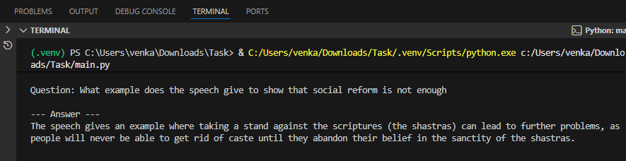

# AmbedkarGPT-Intern-Task

---

## 🎯 Project Overview

AmbedkarGPT is a **command-line Q&A system** that answers questions solely based on a short excerpt from Dr. B.R. Ambedkar's speech, *“Annihilation of Caste.”*  

It demonstrates a **functional prototype** of a RAG pipeline using:
- **LangChain** (orchestration)
- **ChromaDB** (vector store)
- **HuggingFaceEmbeddings** (`sentence-transformers/all-MiniLM-L6-v2`)
- **Ollama LLM** (`llama3.2:1b-instruct-q8_0`)  

💡 Works **offline**, lightweight, and requires **no API keys**.

---
## 🚀 Demo

Ask questions like:

- "What does the speech say is the real remedy for caste?"  
- "What example does the speech give to show that social reform is not enough?"  

### 🎬 Demo Video

<!-- Embed a video hosted on GitHub (or use a link to YouTube/GDrive if file is too large) -->
<video src="AmbedkarGPT_demo.mp4" autoplay loop muted controls width="600">
Your browser does not support the video tag.
</video>

### 🖼 Screenshot

  
## ⚡ Features

- Load `speech.txt` and process it into manageable chunks.
- Generate embeddings for the text and store in **local ChromaDB**.
- Retrieve relevant chunks for user questions.
- Generate answers using **Ollama LLM**.
- Fully **offline**, runs on low RAM models.
- Minimal and clean **command-line interface**.

---

## 🚀 Demo

Ask questions like:

- "What does the speech say is the real remedy for caste?"  
- "What example does the speech give to show that social reform is not enough?"  

## 🛠 Installation

# Create virtual environment
python -m venv .venv
# Activate
# Windows
.venv\Scripts\activate
# macOS/Linux
source .venv/bin/activate

# Install dependencies
pip install -r requirements.txt

# Install Ollama and pull the lightweight model
curl -fsSL https://ollama.ai/install.sh | sh
ollama pull llama3.2:1b-instruct-q8_0

🎮 Usage
python main.py

Type a question related to the speech.

Type exit to quit.

📂 Project Structure
AmbedkarGPT-Intern-Task/
│
├─ main.py          # Main Q&A system
├─ speech.txt       # Speech excerpt
├─ requirements.txt # Dependencies
├─ README.md        # This file
└─ chroma_db/       # Local vector store (auto-generated)
